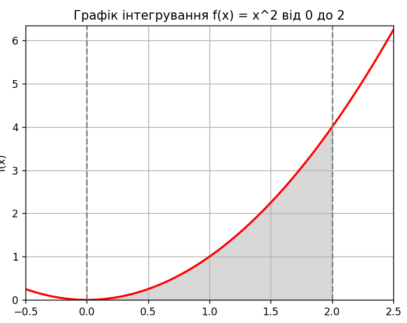

# goit-algo-hw-10

## Results

### Task 2

As can be seen from the results show below, the **Monte-Carlo** approach to solving the problem of calculating the volume of an area within the function curve

has proven to be reasonably effective, producing consistent results (error margin constitutes 0.1 for 20 experiments 15,000 random points each).

Still, compared to the performance of the `quad` function provided by `scipy`, its accuracy is inferior.

Quad: 2.666666666666667

1. Monte-Carlo: 2.266241616807959
2. Monte-Carlo: 2.2926449018815926
3. Monte-Carlo: 2.33073223080085
4. Monte-Carlo: 2.236455632316547
5. Monte-Carlo: 2.257001089765664
6. Monte-Carlo: 2.2584214805988387
7. Monte-Carlo: 2.295508470566657
8. Monte-Carlo: 2.2854937992439814
9. Monte-Carlo: 2.3033924997890334
10. Monte-Carlo: 2.290498398229052
11. Monte-Carlo: 2.3401223255787236
12. Monte-Carlo: 2.290498398229052
13. Monte-Carlo: 2.223045751056016
14. Monte-Carlo: 2.2983738264688744
15. Monte-Carlo: 2.379329401895524
16. Monte-Carlo: 2.3589591475780405
17. Monte-Carlo: 2.3321756320548834
18. Monte-Carlo: 2.2669532084879482
19. Monte-Carlo: 2.237869544487539
20. Monte-Carlo: 2.3401223255787236